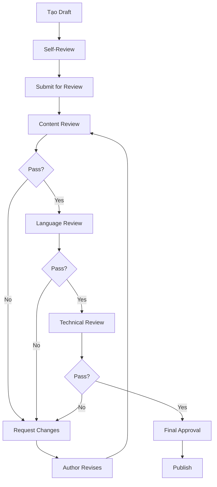

# Quy trình Review và Hoàn thiện Nội dung

## 🎯 Mục tiêu

Thiết lập quy trình chuẩn hóa việc review, hoàn thiện và đảm bảo chất lượng nội dung nghiên cứu chính sách trong repository.

## 👥 Đội ngũ hoàn thiện nội dung

### Vai trò và trách nhiệm

#### 🔍 Content Reviewer (Người review nội dung)

- **Trách nhiệm chính**:
  - Kiểm tra tính chính xác của thông tin
  - Đánh giá độ tin cậy của nguồn tham khảo
  - Kiểm tra logic và mạch lạc của nội dung
  - Đảm bảo tuân thủ template và format

#### ✍️ Content Editor (Biên tập viên)

- **Trách nhiệm chính**:
  - Chỉnh sửa ngữ pháp và phong cách viết
  - Đảm bảo nhất quán về thuật ngữ
  - Cải thiện tính dễ đọc và hiểu
  - Tối ưu hóa cấu trúc nội dung

#### 📚 Subject Matter Expert (Chuyên gia chuyên môn)

- **Trách nhiệm chính**:
  - Xác minh tính chính xác của nội dung chuyên môn
  - Đánh giá mức độ đầy đủ của thông tin
  - Đề xuất bổ sung thông tin quan trọng
  - Kiểm tra tính cập nhật của dữ liệu

#### 🎨 Format Specialist (Chuyên viên định dạng)

- **Trách nhiệm chính**:
  - Đảm bảo tuân thủ chuẩn Markdown và Obsidian
  - Kiểm tra liên kết nội bộ (internal links)
  - Tối ưu hóa tags và metadata
  - Đảm bảo nhất quán về format

## 📋 Quy trình Review 5 Bước

### Bước 1: Pre-Review Check

- [ ] Kiểm tra template đã được sử dụng đúng
- [ ] Đảm bảo metadata cơ bản đã đầy đủ
- [ ] Xác minh có nguồn tham khảo
- [ ] Kiểm tra cấu trúc cơ bản

### Bước 2: Content Review

- [ ] **Tính chính xác**: Thông tin có chính xác không?
- [ ] **Tính đầy đủ**: Có thiếu thông tin quan trọng không?
- [ ] **Tính cập nhật**: Dữ liệu có mới nhất không?
- [ ] **Nguồn tin**: Nguồn có đáng tin cậy không?

### Bước 3: Language & Style Review

- [ ] **Ngữ pháp**: Kiểm tra lỗi chính tả, ngữ pháp
- [ ] **Phong cách**: Đảm bảo nhất quán về tone và style
- [ ] **Thuật ngữ**: Sử dụng thuật ngữ chuẩn và nhất quán
- [ ] **Clarity**: Nội dung dễ hiểu và rõ ràng

### Bước 4: Technical Review

- [ ] **Format**: Tuân thủ chuẩn Markdown
- [ ] **Links**: Kiểm tra internal và external links
- [ ] **Tags**: Sử dụng tags đúng và đầy đủ
- [ ] **Structure**: Cấu trúc logic và dễ navigate

### Bước 5: Final Approval

- [ ] Tất cả reviewer đã approve
- [ ] Không còn comment chưa resolve
- [ ] Đã test links và format
- [ ] Ready for publication

## 📊 Tiêu chí đánh giá chất lượng

### A. Nội dung (60%)

| Tiêu chí | Trọng số | Mô tả |
|----------|----------|--------|
| Tính chính xác | 20% | Thông tin chính xác, có nguồn đáng tin cậy |
| Tính đầy đủ | 15% | Bao phủ đầy đủ các khía cạnh quan trọng |
| Tính cập nhật | 15% | Dữ liệu mới nhất, phản ánh tình hình hiện tại |
| Tính khách quan | 10% | Trình bày cân bằng, không thiên vị |

### B. Trình bày (25%)

| Tiêu chí | Trọng số | Mô tả |
|----------|----------|--------|
| Cấu trúc logic | 10% | Sắp xếp hợp lý, dễ theo dõi |
| Ngôn ngữ | 8% | Văn phong chuyên nghiệp, dễ hiểu |
| Format | 7% | Tuân thủ template, đẹp mắt |

### C. Kỹ thuật (15%)

| Tiêu chí | Trọng số | Mô tả |
|----------|----------|--------|
| Links | 8% | Internal/external links hoạt động |
| Tags | 4% | Sử dụng tags đúng cách |
| Metadata | 3% | Metadata đầy đủ và chính xác |

## 🔄 Workflow Review



## 📝 Template Comments

### Comment Templates cho Reviewer

#### Nội dung

```markdown
**Content Issue**: [Mô tả vấn đề]
**Suggestion**: [Đề xuất cải thiện]
**Priority**: [High/Medium/Low]
```

#### Ngôn ngữ

```markdown
**Language Issue**: [Lỗi cụ thể]
**Correction**: [Cách sửa]
**Reference**: [Nếu có quy tắc cụ thể]
```

#### Kỹ thuật

```markdown
**Technical Issue**: [Vấn đề kỹ thuật]
**Fix**: [Cách khắc phục]
**Impact**: [Ảnh hưởng nếu không sửa]
```

## 🎯 Best Practices

### Cho tác giả

1. **Tự review trước khi submit**: Sử dụng checklist tự kiểm tra
2. **Cung cấp context**: Giải thích mục đích và độc giả mục tiêu
3. **Responsive với feedback**: Phản hồi nhanh chóng với comments
4. **Học hỏi từ review**: Ghi nhận các pattern lỗi để cải thiện

### Cho reviewer

1. **Constructive feedback**: Đưa ra phản hồi xây dựng
2. **Specific comments**: Comments cụ thể, có thể hành động
3. **Timely review**: Review trong thời gian hợp lý
4. **Consistent standards**: Áp dụng tiêu chí nhất quán

## 📈 Metrics và KPIs

### Chất lượng

- Tỷ lệ pass review lần đầu
- Số lượng revision trung bình
- Điểm chất lượng trung bình

### Hiệu quả

- Thời gian review trung bình
- Thời gian từ submit đến publish
- Số lượng nội dung được review/tháng

### Feedback

- Satisfaction score từ tác giả
- Feedback về chất lượng review
- Đề xuất cải thiện quy trình

## 🔧 Tools và Resources

### Review Tools

- [ ] Obsidian với plugins hỗ trợ review
- [ ] Grammar checking tools
- [ ] Fact-checking resources
- [ ] Style guides và dictionaries

### Templates và Checklists

- [ ] [[08-Templates/Policy-Template|Policy Template]]
- [ ] Self-review checklist
- [ ] Reviewer checklist
- [ ] Quality standards guide

## 📚 Tài liệu tham khảo

### Quy tắc viết

- **Ngôn ngữ**: Tiếng Việt chuẩn, tránh từ lóng
- **Tone**: Khách quan, chuyên nghiệp
- **Cấu trúc**: Logic, dễ theo dõi
- **Độ dài**: Tùy thuộc nội dung, ưu tiên tính đầy đủ

### Chuẩn kỹ thuật

- **Markdown**: Tuân thủ CommonMark
- **Obsidian**: Sử dụng đúng syntax cho links và tags
- **File naming**: Kebab-case cho tên file
- **Folder structure**: Theo cấu trúc repository

---

**Ngày tạo**: July 13, 2025  
**Phiên bản**: 1.0  
**Người tạo**: Policy Research Team  
**Next Review**: October 13, 2025
